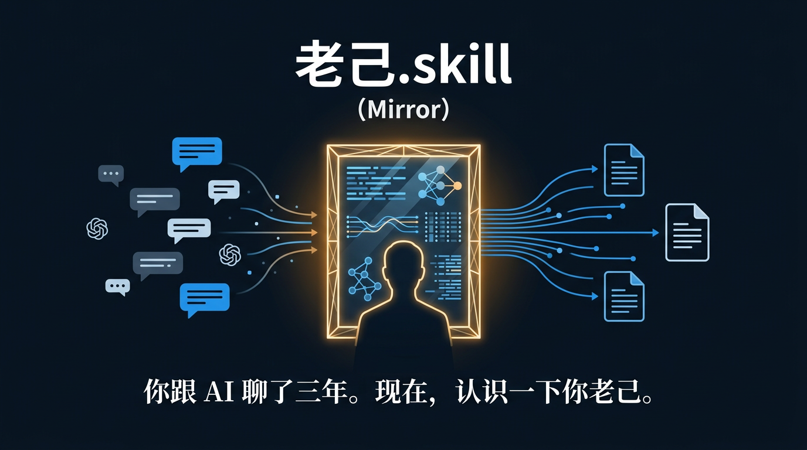
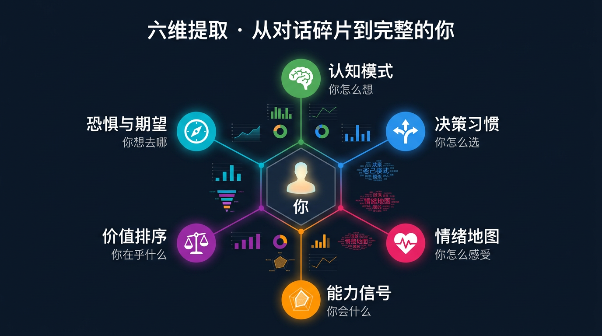
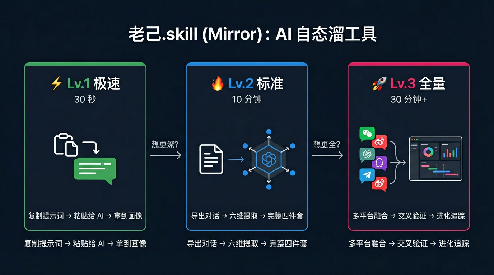
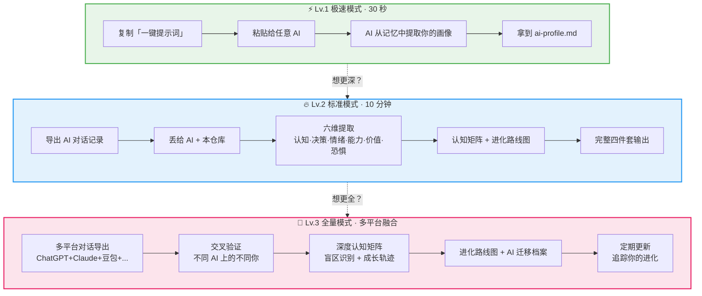
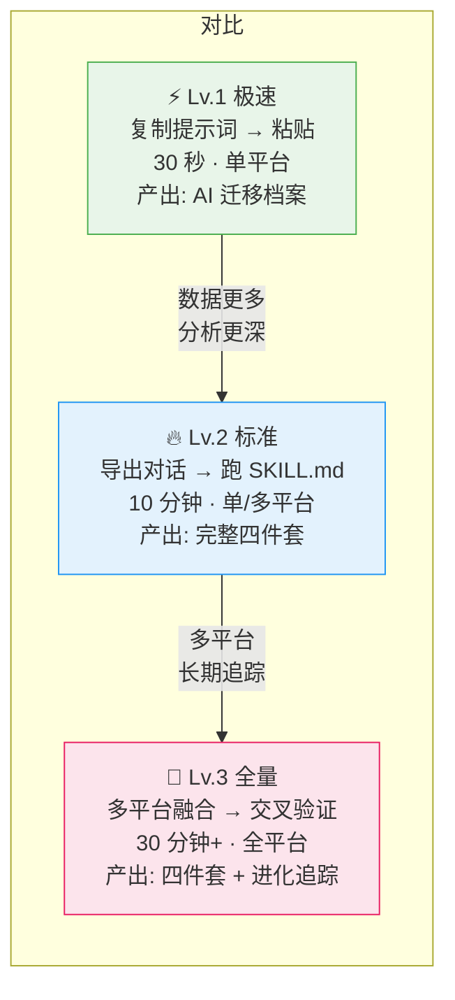

<div align="center">

# 老己.skill (Mirror)

### 你跟 AI 聊了三年。它比你更了解你自己。

### 现在，把这面镜子拿回来。认识一下你老己。

[](LICENSE)
[](https://github.com/agenmod/immortal-skill)
[](SKILL.md)
[](#支持的-ai-平台)

<br/>



</div>

---

<div align="center">

**凌晨三点，你跟 AI 说了你不敢跟任何人说的话。**

**纠结了三个月的决定，你问了 AI 十七遍。**

**你的恐惧、你的野心、你反复犹豫的选择、你真正在乎的东西——**

**AI 全都见过。**

<br/>

但这些碎片散落在 ChatGPT、Claude、豆包、Gemini 的对话记录里。

你换了一个新 AI，一切从零开始。

它不知道你是谁。你又要花三个月「训练」它。

<br/>

**更可惜的是——这些碎片里，藏着一个你自己都没看清的你老己。**

</div>

---

<div align="center">

[这是什么](#这是什么) · [三个价值](#三个你拿不走的价值现在可以拿走了) · [运作流程](#运作流程) · [怎么用](#怎么用) · [Lv.1 极速](#-lv1-极速模式30-秒认识你老己) · [Lv.2 标准](#-lv2-标准模式用本仓库深度蒸馏) · [Lv.3 全量](#-lv3-全量模式多平台融合--进化追踪) · [支持平台](#支持的-ai-平台) · [生态全景](#永生skill-生态)

</div>

---

## 这是什么

**老己.skill (Mirror)** 做一件事：

从你跟各种 AI 的**历史对话**中，蒸馏出**「你老己是谁」**的完整画像。

不是总结你聊了什么。是从你**怎么提问、怎么纠结、怎么做决定、什么让你兴奋、什么让你焦虑**里，提取出一个结构化的「你」。

然后这个「你」可以：
- **照镜子**——看清自己的认知模式、决策习惯、情绪地图
- **画地图**——形成能力矩阵，发现盲区，规划进化路线
- **搬家**——喂给任何新 AI，它立刻成为最懂你的 AI

---

## 三个你拿不走的价值，现在可以拿走了

---

### 🪞 认知镜像：你是谁

<div align="center">

</div>

你跟 AI 聊了几千轮对话。这些对话里藏着：

| 维度 | AI 见过什么 | 你自己可能没意识到 |
|------|-----------|------------------|
| **认知模式** | 你分析问题的方式、你的思维偏好 | 你总是先想风险还是先想机会？ |
| **决策习惯** | 你反复纠结的选择、最终拍板的依据 | 你做决定靠直觉还是靠数据？什么时候会推翻自己？ |
| **情绪地图** | 凌晨 3 点的焦虑、兴奋到语无伦次的时刻 | 什么真正让你恐惧？什么让你不自觉地投入？ |
| **价值排序** | 你在乎什么、你愿意为什么妥协 | 你嘴上说的优先级和实际行为的优先级一样吗？ |
| **关注轨迹** | 你问过的所有问题的主题分布 | 你的注意力在往哪个方向漂移？ |
| **恐惧与期望** | 你反复提到的担忧和梦想 | 你最深的恐惧是什么？你真正想要的生活是什么样？ |

**AI 见过你最真实的样子。** 你不需要在它面前表演。你问的问题、你纠结的方式、你兴奋的瞬间——这些比任何性格测试都准。

**老己做的事**：把这些碎片拼成一面镜子，让你看清你老己。

---

### 📊 能力矩阵与进化路线图

你的对话记录不只是情绪日记。它还是一份**能力档案**。

你问过的每一个问题，都暴露了你**会什么**和**不会什么**：

- 你在哪些领域提问精准、追问深入？→ **核心能力区**
- 你在哪些领域反复问基础问题？→ **待发展区**
- 你从来没问过什么？→ **认知盲区**
- 你的提问水平在哪些领域明显提升了？→ **成长轨迹**

老己从这些信号里构建你的**认知矩阵**：

```
                    高频提问
                       │
         ┌─────────────┼─────────────┐
         │             │             │
    深度追问      基础提问       从未涉及
         │             │             │
    ┌────┴────┐   ┌────┴────┐   ┌────┴────┐
    │核心能力区│   │待发展区  │   │认知盲区  │
    └─────────┘   └─────────┘   └─────────┘
         │             │             │
         └─────────────┼─────────────┘
                       │
              进化路线图：
              你可以往哪走？
              你需要补什么？
              你的方向感在哪？
```

**不是算命。是数据。** 是你自己用几千轮对话「写」出来的能力档案。

老己帮你读懂它，然后给你一张**进化路线图**——不是告诉你「应该」做什么，是告诉你「你的轨迹指向哪里」以及「如果你想去那里，还缺什么」。

---

### 🚀 AI 迁移协议

你花了三个月「训练」ChatGPT 理解你。

然后你想试试 Claude。

**一切从零开始。**

它不知道你喜欢什么风格的回答。不知道你的背景。不知道你在做什么项目。不知道你的思维偏好。不知道你的雷区。

**你又要花三个月。**

老己生成一份标准化的**AI 迁移档案**——一个结构化的「你是谁」文件。

把它喂给任何新 AI，它立刻知道：
- 你是什么样的人（背景、性格、偏好）
- 你在做什么（当前项目、关注领域）
- 你怎么思考（认知模式、决策习惯）
- 你喜欢什么样的回答（风格、深度、节奏）
- 你的雷区在哪（别踩的坑、别说的话）

**你的 AI 记忆不该锁死在一个 App 里。蒸馏你老己，带走它，喂给任何 AI。**

---

## 运作流程

> 老己有三种用法，从「30 秒速成」到「深度蒸馏」，选你需要的深度。

<div align="center">

</div>



---

## 怎么用

### ⚡ Lv.1 极速模式：30 秒认识你老己

**不需要导出任何东西。** 直接把下面这段话复制粘贴给你正在用的 AI（豆包、ChatGPT、Claude、Gemini、Kimi……任何一个你聊过很多的 AI）：

<details>
<summary><b>点击展开 → 一键复制给你的 AI</b></summary>

```
我希望你根据你所了解的所有关于我的信息，为我创建一个全面的个人背景文件。

请从你的记忆系统、我们的所有对话记录、我的自定义指令、以及你从我的提问方式、决策模式、情绪变化中发现的所有模式中提取信息。

请按以下结构输出（跳过你确实不了解的部分，但尽量覆盖）：

## 1. 个人基础档案
姓名、年龄、所在地、职业、家庭情况等你了解到的基础信息。

## 2. 认知模式与思维风格
- 我分析问题的方式（先问为什么 vs 先问怎么做？自顶向下 vs 自底向上？）
- 我的抽象偏好（喜欢具体案例还是抽象框架？）
- 我的类比习惯（我常用什么领域的例子？）
- 我对不确定性的反应（追问到底 vs 接受模糊？）

## 3. 决策习惯
- 我做决定的方式（直觉型 vs 数据型？快刀斩 vs 反复纠结？）
- 我的纠结模式（什么类型的决定让我最犹豫？）
- 什么能改变我的想法？
- 我在时间压力下的默认反应

## 4. 情绪地图
- 什么话题让我焦虑或反复追问？
- 什么让我兴奋到语无伦次？
- 什么让我回避或突然切换话题？
- 我的恐惧指向什么？我的渴望指向什么？

## 5. 能力矩阵
- 我的核心能力区（我追问最深、甚至纠正过你的领域）
- 我的活跃学习区（我频繁提问但还在基础阶段的领域）
- 我的认知盲区（我从未涉及但可能重要的领域，标注为推测）
- 我的成长轨迹（哪些领域我的提问水平明显提升了？）

## 6. 沟通偏好
- 我偏好的回答风格（简洁 vs 详细？严肃 vs 轻松？）
- 我明确要求过的规则（"总是要做X"、"永远不要做Y"）
- 我的雷区（别踩的坑、别说的话）
- 我纠结时需要你做什么（推一把 / 帮我分析 / 给我时间）

## 7. 兴趣与关注领域
- 我经常讨论的话题和长期关注的内容
- 我的注意力最近在往哪个方向漂移？

## 8. 目标与项目
- 我提到过的个人目标和长期规划
- 我正在进行的项目

## 9. 价值观与优先级
- 我真正在乎什么？（从我的行为推断，不只是我说的）
- 我的底线是什么？
- 我嘴上说的优先级和实际行为的优先级一致吗？

## 10. 矛盾之处
- 你观察到我哪些地方「说的和做的不一样」？
- 我有哪些自相矛盾的偏好或行为？

最后，基于以上所有信息，生成一份【AI 迁移档案】—— 一个结构化的「关于我」文件，格式如下，让任何新 AI 拿到就能立刻理解我：

---
# 关于我
## 基本画像
[50-100 字]
## 我的认知风格
[风格标签 + 一句话解释]
## 我在做什么
[当前关注 + 项目]
## 怎么跟我对话
[风格偏好 + 雷区 + 纠结时的应对]
## 我的能力边界
[擅长 / 在学 / 盲区]
## 我在乎什么
[价值排序 + 底线]
---

请尽可能诚实。如果某个维度你数据不够，就说数据不够，不要编造。
```

</details>

**就这么简单。** 复制 → 粘贴 → 30 秒后你就能看到 AI 眼中的你。

> **提示**：在你聊得最多的那个 AI 上效果最好。如果你在多个 AI 上都做了，把结果合在一起就是更完整的你。

---

### 🔥 Lv.2 标准模式：用本仓库深度蒸馏

**安装**

```bash
git clone https://github.com/agenmod/mirror-skill.git
```

**第一步**：导出你的 AI 对话记录。详见 [各平台导出指南](docs/platform-export.md)。

**第二步**：把导出的对话和本仓库一起丢给 Cursor / Claude / 任何 Agent：

```
请读 SKILL.md，用我导出的 AI 对话记录，帮我蒸馏出「我是谁」。
```

**第三步**：AI 会按 Phase 引导你完成六维提取 → 认知矩阵 → 进化路线图 → AI 迁移档案，输出完整四件套。

---

### 🚀 Lv.3 全量模式：多平台融合 + 进化追踪

导出你所有 AI 平台的对话记录，交叉验证。不同 AI 上你展现的是不同的自己——拼在一起才是完整的你。

每 3-6 个月重新提取一次，追踪你的认知进化轨迹。

---

## 三种模式对比



---

## 支持的 AI 平台

| 平台 | 导出方式 | 数据丰富度 |
|------|---------|-----------|
| **ChatGPT** | 设置 → 数据控制 → 导出数据 | ⭐⭐⭐⭐⭐ |
| **Claude** | 设置 → 导出对话 | ⭐⭐⭐⭐⭐ |
| **豆包** | 对话记录手动导出 / 截图 OCR | ⭐⭐⭐ |
| **Gemini** | Google Takeout | ⭐⭐⭐⭐ |
| **Kimi** | 对话记录导出 | ⭐⭐⭐ |
| **通义千问** | 对话记录导出 | ⭐⭐⭐ |
| **DeepSeek** | 对话记录导出 | ⭐⭐⭐ |
| **Cursor / Windsurf** | 项目对话记录 | ⭐⭐⭐⭐ |
| **任意平台** | 手动复制粘贴 / 截图 OCR | ⭐⭐ |

**多平台混合效果最好**——不同 AI 上你展现的是不同的自己。ChatGPT 上的你可能更日常，Claude 上的你可能更技术，豆包上的你可能更生活。**拼在一起才是完整的你。**

---

## 蒸馏出来长什么样

```
my-mirror/
├── self-portrait.md        ← 你是谁：认知模式、决策习惯、情绪地图、价值排序
├── capability-matrix.md    ← 能力矩阵：核心区、待发展区、盲区
├── evolution-roadmap.md    ← 进化路线图：方向感、需要补的维度
├── ai-profile.md           ← AI 迁移档案：喂给新 AI 的标准文件
└── manifest.json           ← 元数据（来源平台、时间、覆盖度）
```

---

## 完整蒸馏流程

```mermaid
flowchart LR
    subgraph INPUT["📥 输入"]
        I1["ChatGPT 对话"]
        I2["Claude 对话"]
        I3["豆包 / Gemini / ..."]
        I4["Cursor 项目记录"]
    end

    subgraph EXTRACT["🔬 Phase 1: 六维提取"]
        E1["认知模式"]
        E2["决策习惯"]
        E3["情绪地图"]
        E4["能力信号"]
        E5["价值排序"]
        E6["恐惧与期望"]
    end

    subgraph BUILD["🧠 Phase 2-3: 构建"]
        B1["认知矩阵\n能力图谱 + 盲区"]
        B2["成长轨迹\n时间线分析"]
        B3["进化路线图\n方向感 + 建议"]
    end

    subgraph OUTPUT["📦 Phase 4-5: 输出"]
        O1["self-portrait.md\n你是谁"]
        O2["capability-matrix.md\n你会什么"]
        O3["evolution-roadmap.md\n你往哪走"]
        O4["ai-profile.md\n喂给新 AI"]
    end

    INPUT --> EXTRACT
    EXTRACT --> BUILD
    BUILD --> OUTPUT

    style INPUT fill:#1a237e,stroke:#5c6bc0,color:#fff
    style EXTRACT fill:#004d40,stroke:#26a69a,color:#fff
    style BUILD fill:#4a148c,stroke:#ab47bc,color:#fff
    style OUTPUT fill:#b71c1c,stroke:#ef5350,color:#fff
```



---

## 为什么这件事很重要

你每天跟 AI 聊天，本质上是在做一件事：**把你脑子里的东西外化。**

你的问题暴露了你的认知边界。你的纠结暴露了你的价值冲突。你的兴奋暴露了你的真实渴望。你的恐惧暴露了你的底线。

**这些信息的价值远超对话本身。**

但现在，这些信息：
- **锁死在各个平台里**——你换了 AI 就丢了
- **散落成碎片**——你自己都不记得聊过什么
- **没有被结构化**——原始对话记录看了也看不出规律

老己做的事就是：**把这些碎片变成镜子，把锁死的记忆变成可迁移的资产，把无意识的轨迹变成有意识的方向。**

---

## 永生.skill 生态

老己 (Mirror) 是 **永生.skill** 数字永生框架的自我认知组件。完整生态：

| 组件 | 做什么 | 仓库 |
|------|--------|------|
| **永生.skill** | 通用数字永生框架：四维蒸馏引擎 | [immortal-skill](https://github.com/agenmod/immortal-skill) |
| **蒸笼** | 蒸馏任何人的认知框架当参谋 | [steamer-skill](https://github.com/agenmod/steamer-skill) |
| **防蒸馏** | 三层纵深防御，不做数字裸奔 | [distill-shield-skill](https://github.com/agenmod/distill-shield-skill) |
| **蒸馏协议** | 六问分离授权，aka「牛马保护法」 | [distill-protocol-skill](https://github.com/agenmod/distill-protocol-skill) |
| **老己 (Mirror)** | 从 AI 对话中蒸馏「你老己是谁」（你在这里） | mirror-skill |
| **OKR.skill** | AI 驱动的 OKR 实战框架 | [okr-skill](https://github.com/agenmod/okr-skill) |

---

<div align="center">

## 最后说句正经的。

你跟 AI 聊了几千轮。

这些对话里，藏着一个你自己都没看清的你。

你的恐惧。你的渴望。你的能力边界。你的进化方向。

**别让它们烂在聊天记录里。是时候认识一下你老己了。**

<br/>

**⭐ Star 一下。下次换 AI 的时候，你不用从零开始。**

<br/>

MIT License · 回 **[永生.skill 主页](https://github.com/agenmod/immortal-skill)**

</div>
